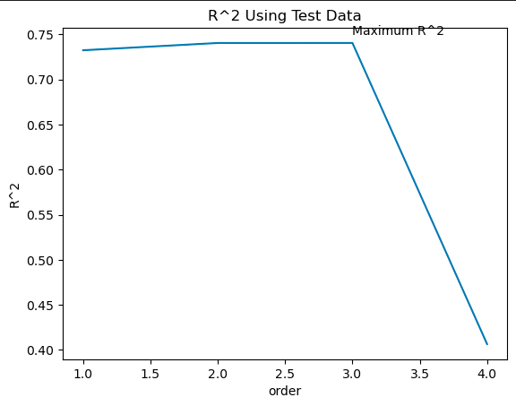
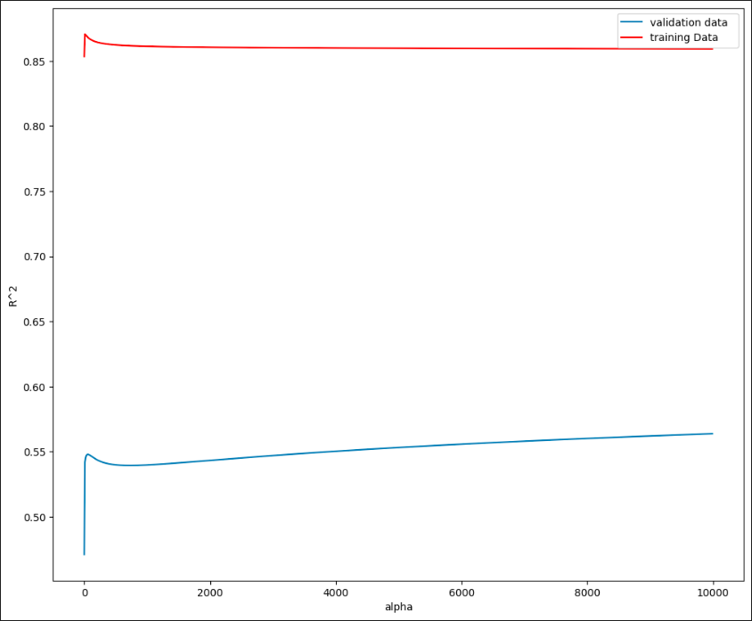

# Automobiles Machine Learning Analysis

## Introduction
This repository contains the analysis and machine learning model implementation for the automobile dataset. The goal is to predict various automobile attributes using different machine learning techniques.

## Table of Contents
1. Data Import and Cleaning
2. Exploratory Data Analysis (EDA)
3. Model Evaluation
4. Over-fitting, Under-fitting, and Model Selection
5. Ridge Regression
6. Grid Search

## Technologies Used
- **Programming Language**: Python
- **Libraries**: Pandas, NumPy, Scikit-Learn
- **Tools**: Jupyter Notebook

## R-squared (R²) Values:
- Linear Regression: 0.3636
- Multiple Linear Regression: 0.6619
- Polynomial Regression (degree 5): 0.5568
- Ridge Regression (best alpha=10000): 0.8412

## Getting Started
To get started with this project, clone the repository and install the necessary dependencies:
```bash
git clone https://github.com/burhanahmed1/Automobiles-MachineLearning-Analysis.git
cd Automobiles-MachineLearning-Analysis
pip install -r requirements.txt
```

## Usage
Open the Jupyter notebook:
```bash
jupyter notebook AutoMobile-ML.ipynb
```

## Dataset
The dataset used in this analysis is AutoMobile-Dataset-3.csv, which contains various features related to automobiles such as make, body style, engine type, horsepower, and price.

## R^2 scores
<div align="center">
  
  **R^2** scores of the **Linear Regression** model created using different degrees of polynomial features, ranging from 1 to 4.
  
  
  **R^2** values of **Ridge Regression** model for training and testing sets with respect to the values of alpha.
  
</div>

## Contributing
Contributions are welcome! Please fork this repository and submit pull requests.

## License
This project is licensed under the MIT License.

